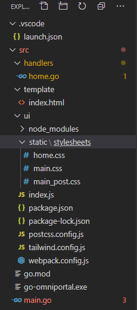

Lets us create a simpe web appilcation which will serve static files a html template using golang

Here is how the structure of my project looks like. Ignore the npm and config files.



Here is the full code snippets from main and handler 

```main.go

func main() {
  // parses all the html template files placed in this folder
	t := template.Must(template.ParseGlob("template/*"))
  
  // hosts the specified directory
	fs := http.FileServer(http.Dir("./ui/"))

  //maps the hosted file server to the route "/static/"
	http.Handle("/static/", fs)
  
  // moved the http hanlders to a different package to keep the main clean.
  // also provided a way to pass arguments from main to handlers
	http.HandleFunc("/", handlers.Home(t))

	fmt.Println("Listenting on 8000")
	fmt.Println(http.ListenAndServe(":8000", nil))
}

```
```handlers/home.go

//Home .. handles "/" route
func Home(t *template.Template) func(http.ResponseWriter, *http.Request) {
  // create a sample message struct which can be used inside the template html files
	m := Message{"Arjun", "Hello"}

  // returning a handler func
	return func(w http.ResponseWriter, r *http.Request) {
		if name := r.FormValue("name"); name != "" {
			m.Name = name
		}
    // "Execute" method will pass the message to the html template where we will use 
    // the properties of this message 
		if err := t.Execute(w, m); err != nil {
			http.Error(w, "Failed to execute the template", 500)
		}
	}
}
```

Explainations as inline comments.

Inside the html file this is how you access the properties of the model passed.

```html

<title>Hi {{.Name}}</title>

```


#### Further Reading for details on the go packages used

- [golang http package - used to create the web server](https://golang.org/pkg/net/http/)
- [template - used for passsing data from the server](https://golang.org/pkg/html/template/)
